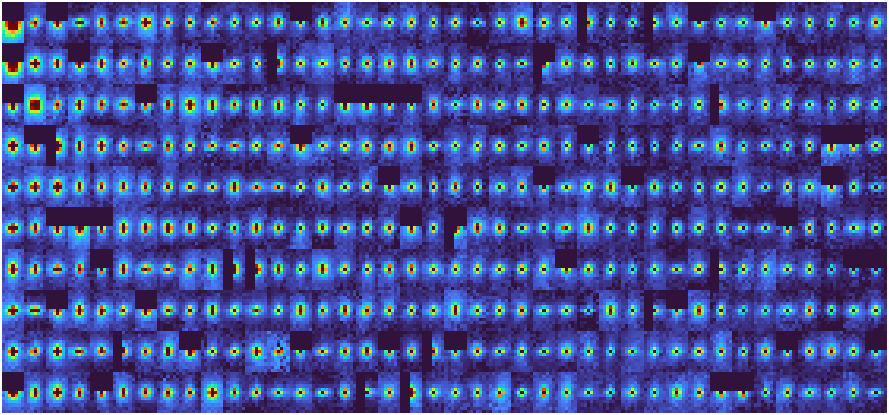
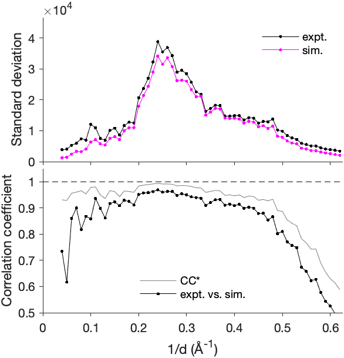
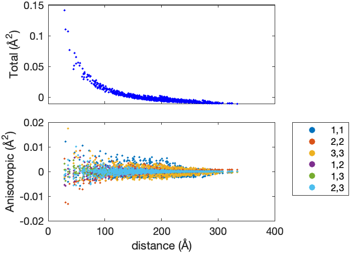
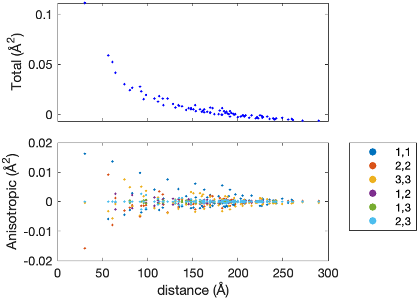
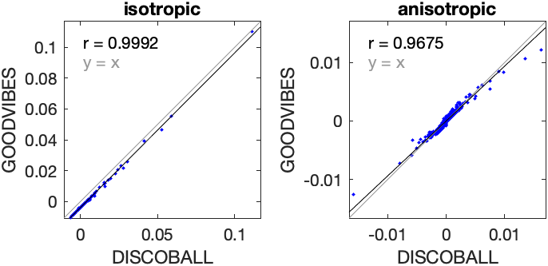
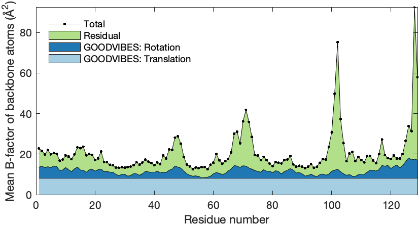
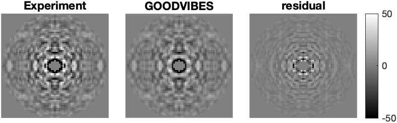
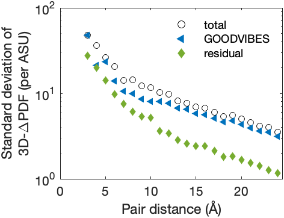
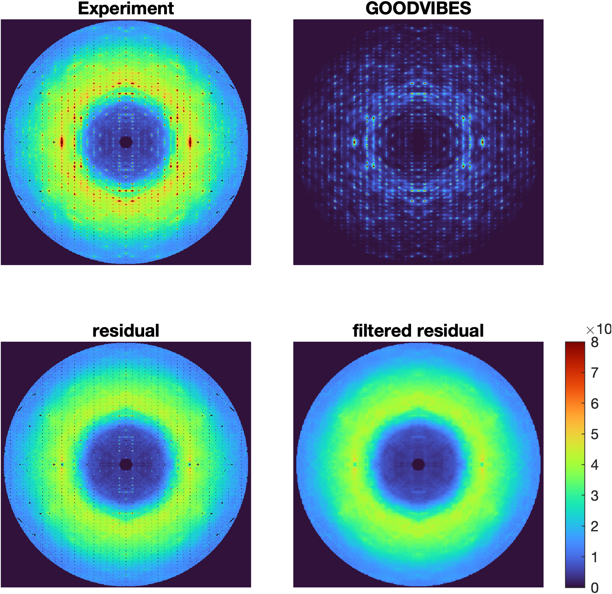

# Report: orthorhombic lysozyme modeling

24-Aug-2022 21:49:10

## Reference halos



## GOODVIBES refinement

Stage | Spring type | Parameterization | Number of parameters | Number of iterations | Chi-squared
--- | --- | --- | --- | --- | ---
1 | Gaussian | global | 1 | 2 | 2.87762
2 | Gaussian | interface | 3 | 5 | 2.11791
3 | hybrid | interface | 6 | 5 | 1.63007
4 | hybrid | uniquegrouped | 76 | 129 | 1.48635

## Intensity statistics



## GOODVIBES joint-ADPs



## DISCOBALL joint-ADPs



## DISCOBALL validation



## GOODVIBES ADPs

**Center of mass** (Å)

```
-2.83744      12.5095     -15.8399
```

**Center of reaction** (Å)

```
-2.93755      12.6192     -13.3072
```

**T** (center of reaction, Å^2)

```
  0.10684   -0.012921   0.0018521
-0.012921    0.085547  -0.0064227
0.0018521  -0.0064227     0.11325
```

**L** (center of reaction, deg^2)

```
   1.124    -0.16816     0.28521
-0.16816      1.2385    -0.15034
 0.28521    -0.15034      1.3831
```

**S** (center of reaction, Å deg)

```
-0.027277    0.028028     0.04048
 0.028028     0.02281   0.0074158
  0.04048   0.0074158   0.0058827
```



## 3D-ΔPDF subtraction



## 3D-ΔPDF statistics



## Diffuse subtraction



