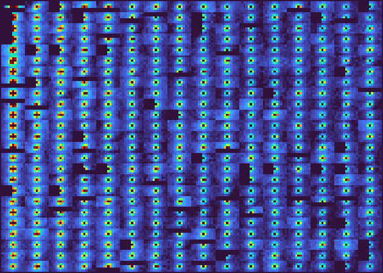
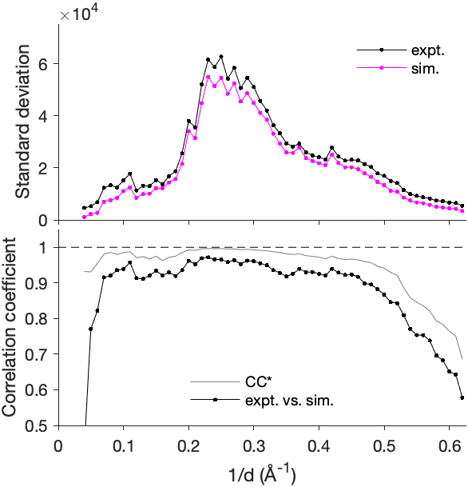
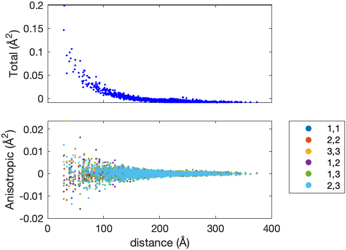
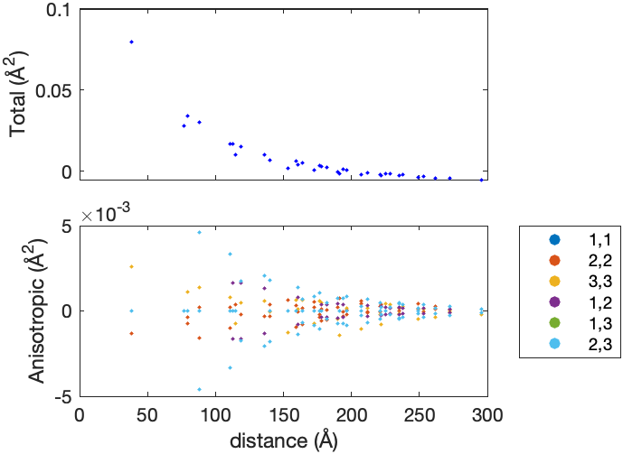
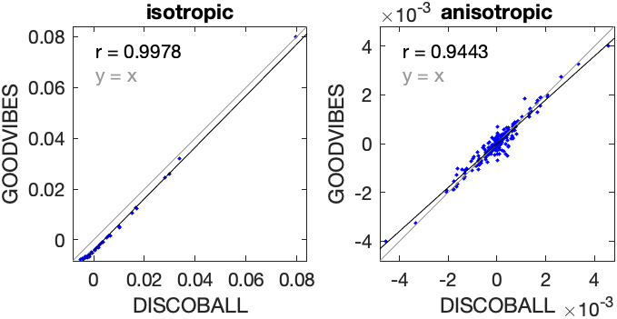
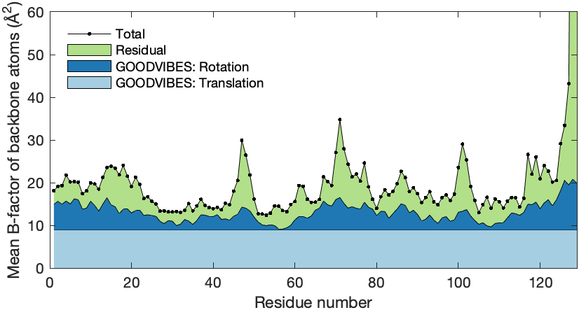
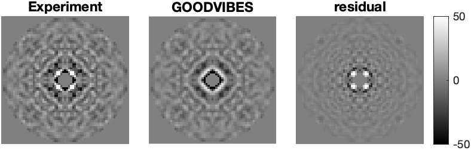
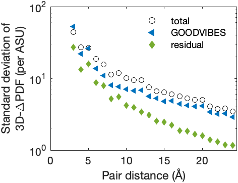
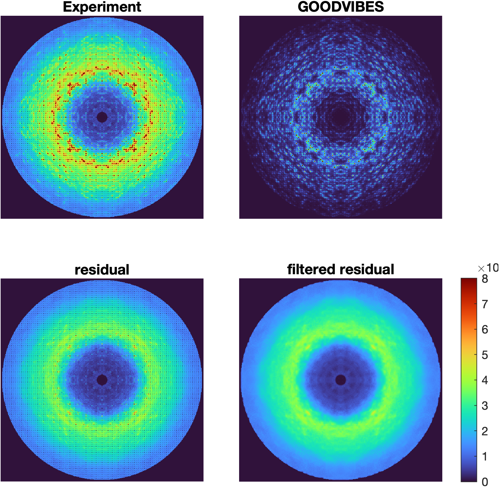

# Report: tetragonal lysozyme modeling

24-Aug-2022 21:52:05

## Reference halos



## GOODVIBES refinement

Stage | Spring type | Parameterization | Number of parameters | Number of iterations | Chi-squared
--- | --- | --- | --- | --- | ---
1 | Gaussian | global | 1 | 2 | 3.32655
2 | Gaussian | interface | 5 | 13 | 2.89108
3 | hybrid | interface | 10 | 18 | 2.10976
4 | hybrid | uniquegrouped | 62 | 40 | 1.72471

## Intensity statistics



## GOODVIBES joint-ADPs



## DISCOBALL joint-ADPs



## DISCOBALL validation



## GOODVIBES ADPs

**Center of mass** (Å)

```
-0.591069      20.6837      19.4105
```

**Center of reaction** (Å)

```
2.03729      22.6585      21.1154
```

**T** (center of reaction, Å^2)

```
 0.094111   0.0043059    0.012444
0.0043059     0.11381  -0.0094822
 0.012444  -0.0094822     0.12857
```

**L** (center of reaction, deg^2)

```
  1.6657    -0.49795     0.38728
-0.49795      1.3163   -0.020107
 0.38728   -0.020107      1.1427
```

**S** (center of reaction, Å deg)

```
  0.02734   -0.020845   0.0013806
-0.020845  -0.0030538    0.035805
0.0013806    0.035805   -0.018142
```



## 3D-ΔPDF subtraction



## 3D-ΔPDF statistics



## Diffuse subtraction



