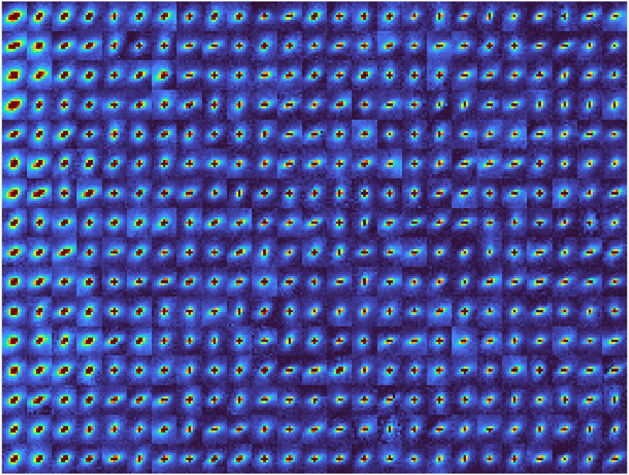
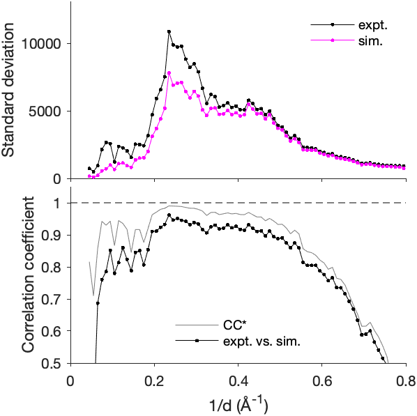
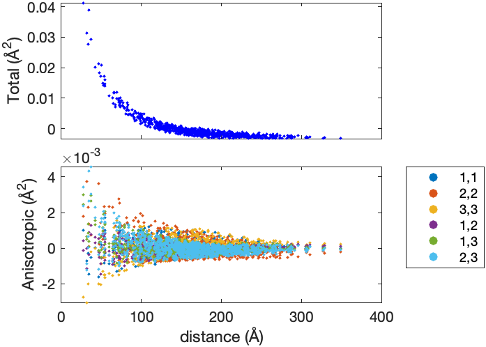
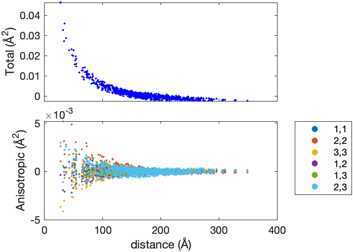
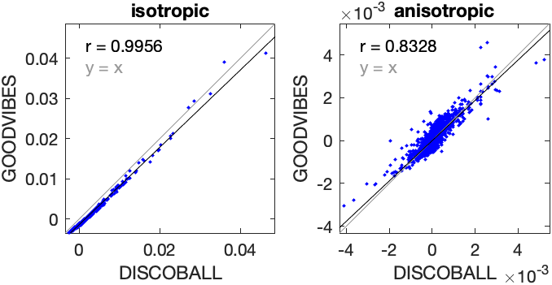
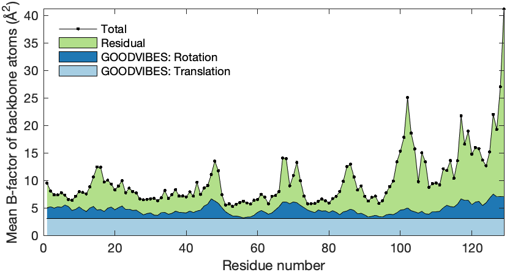
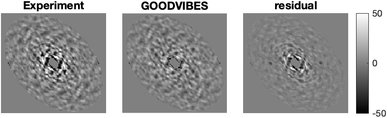
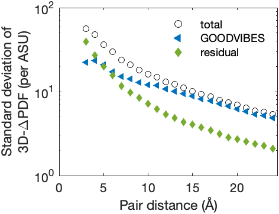
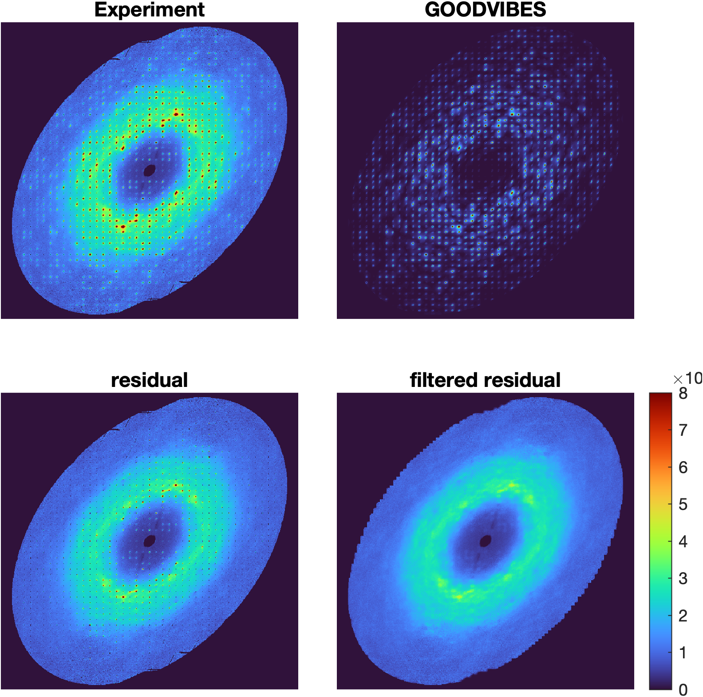

# Report: triclinic lysozyme modeling

24-Aug-2022 22:55:04

## Reference halos



## GOODVIBES refinement

Stage | Spring type | Parameterization | Number of parameters | Number of iterations | Chi-squared
--- | --- | --- | --- | --- | ---
1 | Gaussian | global | 1 | 2 | 4.10721
2 | Gaussian | interface | 6 | 7 | 3.25565
3 | hybrid | interface | 12 | 8 | 2.72177
4 | hybrid | uniquegrouped | 110 | 57 | 2.19859

## Intensity statistics



## GOODVIBES joint-ADPs



## DISCOBALL joint-ADPs



## DISCOBALL validation



## GOODVIBES ADPs

**Center of mass** (Å)

```
-1.00993      14.4634      24.3258
```

**Center of reaction** (Å)

```
-1.86008      13.0631      25.7685
```

**T** (center of reaction, Å^2)

```
   0.03638  -0.0002376   0.0037823
-0.0002376    0.045012   0.0022507
 0.0037823   0.0022507    0.035079
```

**L** (center of reaction, deg^2)

```
  0.51195    -0.02046   -0.056083
 -0.02046     0.54628    -0.10307
-0.056083    -0.10307     0.57491
```

**S** (center of reaction, Å deg)

```
 0.0067878  -0.0070832   0.0029339
-0.0070832   0.0028619  0.00071988
 0.0029339  0.00071988  -0.0080237
```



## 3D-ΔPDF subtraction



## 3D-ΔPDF statistics



## Diffuse subtraction



